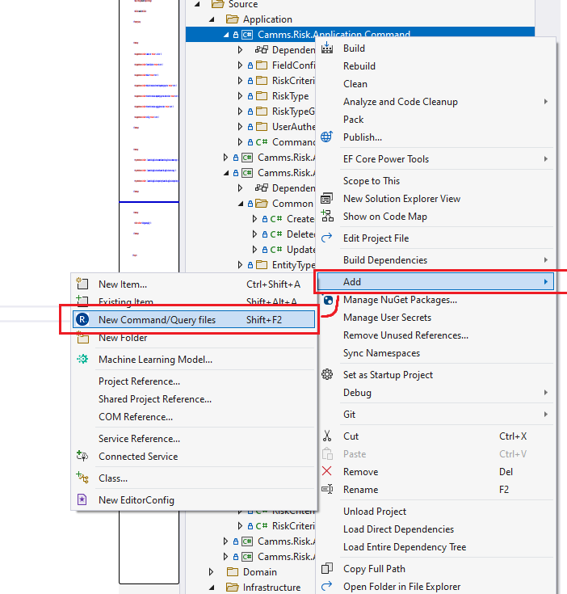
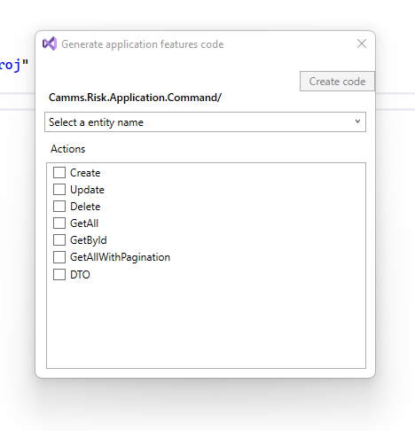
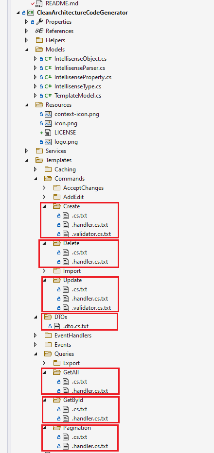

# Code Generator for Risk Project 

Download the extension at the
[VS Gallery]https://marketplace.visualstudio.com/items?itemName=CSandun.riskcqrs)

### Introduction

A Visual Studio extension for easily create application features code  to CQRS based clean architecture  project files for usecases. Simply hit Shift+F2 to create an empty file in the
selected folder or in the same folder as the selected file.

See the [changelog](CHANGELOG.md) for updates and roadmap.

### Features

- Easily create following application features code
    - Create command
    - Update command
    - Delete command
    - Get all query
    - Get all with pagination
    - Get by id
    - Generate Dto

### Show the dialog

A new button is added to the context menu in Solution Explorer.

You can either click that button or use the keybord shortcut **Shift+F2**.

Select Entity Name from Domain Project

### Code templates
You can modify these templates according to your own projects

## Contribute
Check out the [contribution guidelines](.github/CONTRIBUTING.md)
if you want to contribute to this project.

For cloning and building this project yourself, make sure
to install the
[Extensibility Tools 2015](https://marketplace.visualstudio.com/items?itemName=MadsKristensen.ExtensibilityTools)
extension for Visual Studio which enables some features
used by this project.

## License
[Apache 2.0](LICENSE)
